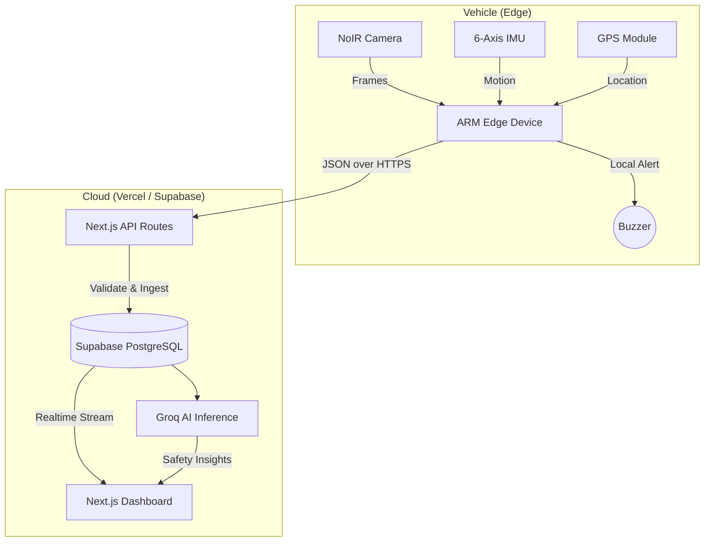

<div align="center">
  
  <h1>SADAN</h1>
  <h3>Smart and Affordable Driver Assistance Node</h3>
  <p>A next-generation, affordable fleet safety intelligence platform built to monitor driver behavior, prevent accidents, and deliver real-time AI insights for small and medium logistics fleets in India.</p>
</div>

---

## 🚦 The Problem
Small fleet operators in India rely heavily on legacy commercial vehicles lacking modern safety features. On long, arduous routes, drivers face immense fatigue. Harsh driving (sudden braking, rapid acceleration) often goes undetected, and fleet managers operate with zero visibility into on-road realities until an accident occurs.

## 💡 The Solution
**SADAN** bridges this gap using a hybrid Edge-Cloud architecture. 
An affordable ARM-based edge device installed in the vehicle acts as a localized "black box" and safety monitor. It analyzes driver state locally to provide instant acoustic alerts, while simultaneously syncing telemetry to a cloud dashboard for fleet-wide monitoring and AI-powered intelligence.

### Key Features
- **👀 Real-Time Drowsiness Detection**: Uses a NoIR camera and facial landmark analysis on the edge.
- **🏎️ Harsh Driving Detection**: Analyzes 6-axis IMU data to detect hard braking, sudden acceleration, and erratic steering.
- **⚡ Zero-Latency Alerts**: Alerts the driver instantly via a local buzzer—no cloud round-trip required.
- **🛰️ Live Fleet Tracking**: Real-time GPS location tracking on a dark-mode, high-performance MapLibre GL dashboard.
- **🧠 AI Safety Intelligence**: Leverages Groq's blazing-fast LLM API to analyze telemetry data and generate comprehensive, natural-language safety reports.
- **📴 Offline Resilience**: Safety-critical detections and alerts continue working even when cellular connectivity drops.
- **🎮 Built-in Simulator**: Features a web-based edge device simulator to generate live, realistic telemetry for testing and demonstration.

---

## 🏗️ Architecture

SADAN employs a robust Edge-to-Cloud data flow.



## 🛠️ Tech Stack

| Domain | Technologies Used |
|---|---|
| **Frontend** | Next.js 16.3 (App Router), React 19, Tailwind CSS 4, Framer Motion |
| **Backend** | Next.js Route Handlers, Node.js |
| **Database** | Supabase (PostgreSQL, Realtime, Auth, RLS) |
| **AI Integration** | Groq API (`openai/gpt-oss-20b` / `llama-3.1-8b-instant`), AI SDK |
| **Mapping** | MapLibre GL, MapTiler DataViz Dark |
| **Components** | shadcn/ui, Radix UI, Base UI, Lucide React, Recharts |
| **Validation** | Zod |

---

## 🚀 Getting Started

### Prerequisites
- Node.js 20+
- A [Supabase](https://supabase.com) project
- A [Groq](https://console.groq.com) API Key
- A [MapTiler](https://maptiler.com) API Key (for maps)

### Local Setup

1. **Clone & Install**
   ```bash
   git clone https://github.com/your-org/sadan.git
   cd sadan
   npm install
   ```

2. **Environment Configuration**
   ```bash
   cp .env.example .env.local
   ```
   Fill in your `.env.local` with the required keys (Supabase URL/Anon/Service Role, Groq API, MapTiler API).

3. **Database Initialization**
   Run the provided SQL migrations in your Supabase SQL editor:
   - `001_initial_schema.sql`
   - `002_seed_data.sql`
   - `003_rls_policies.sql`

4. **Start Development Server**
   ```bash
   npm run dev
   ```
   Visit `http://localhost:3000` and sign in.

---

## 📂 Project Structure

```text
├── app/                  # Next.js App Router (Dashboard, API, Auth)
├── components/           # Reusable UI components & Dashboard panels
├── config/               # App configuration (Navigation, Constants)
├── hooks/                # Custom React hooks (Live Polling, etc.)
├── lib/                  # Core Business Logic (AI, API, Database, Safety)
├── supabase/migrations/  # PostgreSQL schema definitions and seeds
├── public/               # Static assets
└── types/                # Strict TypeScript interfaces
```

---

## 📜 License & Acknowledgements

- Built specifically for **MSME Hackathon 6.0**.
- UI inspired by modern, premium, dark-mode SaaS platforms.
